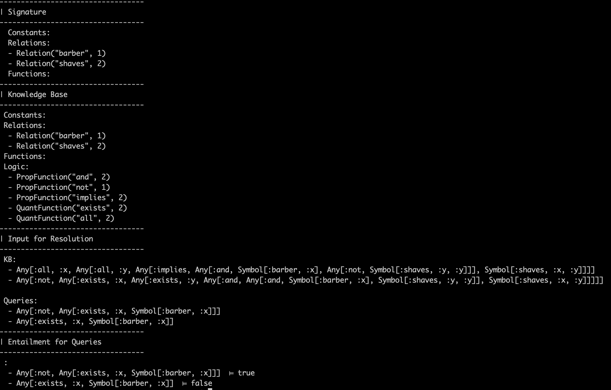

# Logic AI Engine

This algorithm parses first order logic statements in a knowledge base, takes a query, and gives an answer to that query using resolution.


## Custom Language Explanation

The language is in prefix notation, so that one can write the statement:

`[Predicate, x, ...]`

The language requires statements to be written in lists. In native Julia, this should be a list of symbols, but it is easier to provide in a different .yml format.

In Julia: 

`[:Friend, :x, :y]`


## Input format

Input can be directly as Julia code, but is much easier using the .yml format. 

Please take a look at the input.yml file to see how to formulate the knowledge base, query, and signature. Here is an example of an input.yml file:

```
signature:
  constants:

  functions:

  relations:
    shaves:
      name: shaves
      arity: 2
    barber:
      name: barber
      arity: 1


knowledge_base:
    - [all, x, [all, y, [implies, [and, [barber, x],
                                        [not, [shaves, y, y]]],
                                  [shaves, x, y]]]]

    - [not, [exists, x, [exists, y, [and, [and, [barber, x],
                                                [shaves, y, y]],
                                          [shaves, x, y]]]]]

query:
  - [not, [exists, x, [barber, x]]]
  - [exists, x, [barber, x]]
```

Another example:
```
signature:
  constants:
    - Peter
    - Adam
    - Eve
    - Eva

  functions:
    mother:
      name: Mother!
      arity: 1
  relations:
    friend:
      name: Friend
      arity: 2
    enemy:
      name: Enemy
      arity: 2

knowledge_base:
    - [or, [Friend, Peter, Eve], [Friend, Peter, Adam]]
    - [not, [Friend, Peter, Eve]]

query:
  - Dana
  - [Friend, Peter, Adam]
```

### Formatting the data

The input must be in a file called `input.yml` and contain a `knowledge_base`, `query`, and valid `signature`. 

### Data Format
Logical expressions are formated as lists, even in the native julia code. In the input.yml, the any first order logic expression must either be:

- a constant, which is not surrounded by brackets in a list.
- an expression, which is a list.

The following is valid:
- Dana

The following is invalid
- [Dana]

### Valid operators:

Predicate Logic:
- `and, or, not, implies, double_implies`

Quantifiers:
- `exists, all`

Other:
- `equal`   (I was planning on implementing something like [equal, [Mother!, John], Eve], so the engine could directly look it up but didn't get around to adding this optimization.

### For the signature:

- constants: shown above, separate with dashes on new lines
    
- functions: MUST END WITH AN ! to be parsed correctly. So `Mother` is not a valid function name, but `Mother!` is! Must also provide name and arity.
    
- relations: Must provide name and arity, and not end in a !. 
    

### For the query:
Must provide a list of queries separated with a - on new lines. 

## Running the Code
Once you have the data set up in an input.yml file, you're ready to run the engine.  The command is:

`julia main_input.jl`

This will output the following:



## Errors
If the input.yml is not formatted correctly (lists are missing brackets, spacing incorrect, etc.) there will be errors that the program cannot catch. 

If the file is formatted properly, errors in the knowledge base deduced from the signature will be presented to the user. This can happen if constants, arity, etc. are incorrect.

## Unit Tests
This code is near 100% unit tested. Simply run:

```
julia test_logic_conversion.jl

julia test_mgu.jl

julia test_resolution.jl
```


## Assignment Specific Remarks
Each part of the assignment is broken up to it's own file to see the results if necessary. This will show output for Conjunctive normal form, most general unifier, and resolution.

To run the separate parts:

```
julia main_cnf.yml

julia main_mgu.yml

julia main_resolution.yml
```


